<!-- _class: lead -->
<!-- _paginate: skip -->

CE 439 / CE 498R

<h1>2026 Study Abroad Report</h1>

Water &amp; Sustainability Netherlands and Denmark

Daniel P. Ames Faculty meeting, September 2026

<figure>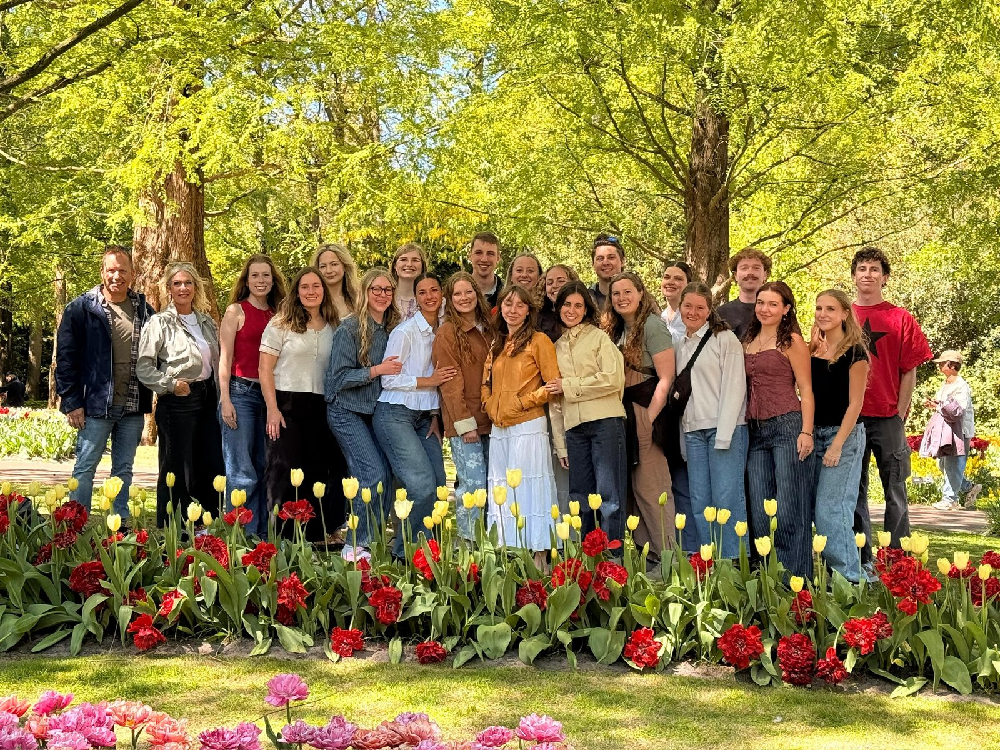<figcaption>2026 cohort and Ames family at Keukenhof</figcaption></figure>

<!--
The 2026 program combined preparation at BYU with 18 days in the Netherlands and Denmark. Students studied water resources infrastructure and completed five capstone reports on Dutch Room for the River projects. The photo shows the cohort and Ames family at Keukenhof Gardens. Photo: existing program deck.
-->

---

# Academic preparation and field study

<ul>
<li><strong>Prerequisites:</strong> CE 414 GIS and CE 331 - Hydrology</li>
<li><strong>Winter, CE 471:</strong> GIS data and flood models for five study sites</li>
<li><strong>CE 439 field study:</strong> 3 credits, 18 days of visits and technical briefings</li>
<li><strong>CE 498R capstone:</strong> technical reports on completed river projects</li>
</ul>

<figure>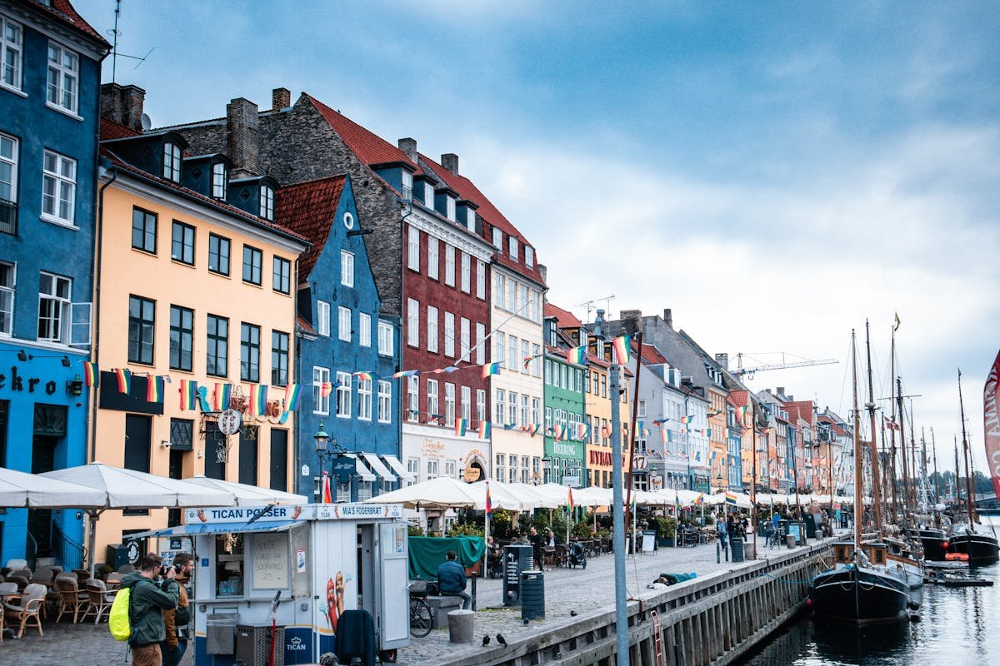<figcaption>Copenhagen: harbor water quality, recreation, and coastal protection</figcaption></figure>
<strong>2026 side trip:</strong> 3 nights in Denmark A rotating destination to keep it fresh and interesting

<!--
CE 414 and CE 331 provide GIS and hydrology preparation. Winter work in CE 471 focused on GIS layers and static flood models. The original curriculum description lists the three-credit field course as CE 439 / CE 431, International Challenges in Water Resources, with reports contributing to senior capstone evaluation. The Netherlands provides examples of land reclamation, polders, and Building with Nature. The original program overview reports 26% of the country below sea level and over half vulnerable to flooding. The destination rotates to keep it fresh and interesting. The three-night side trip has included Belgium, Germany, France, and Scotland. Denmark added study of coastal defenses and harbor recreation and helped identify future field sites. Photo and curriculum context: original program deck.
-->

---

# Cohort, support, and logistics

<strong>18 students</strong> 14 women and 4 men

Sophomores through seniors Water resources, environmental, and structural interests - all capstone eligible

<strong>Advertised cost: $4,900–$5,300</strong> <strong>Final cost: $4,500 per student</strong> After department support of $750 each

Other support: Weidman Center and Kennedy Center scholarships

<strong>One Delft hotel for 14 Dutch nights</strong> Day trips within 2.5 hours of the hotel 3 nights in Denmark

<figure>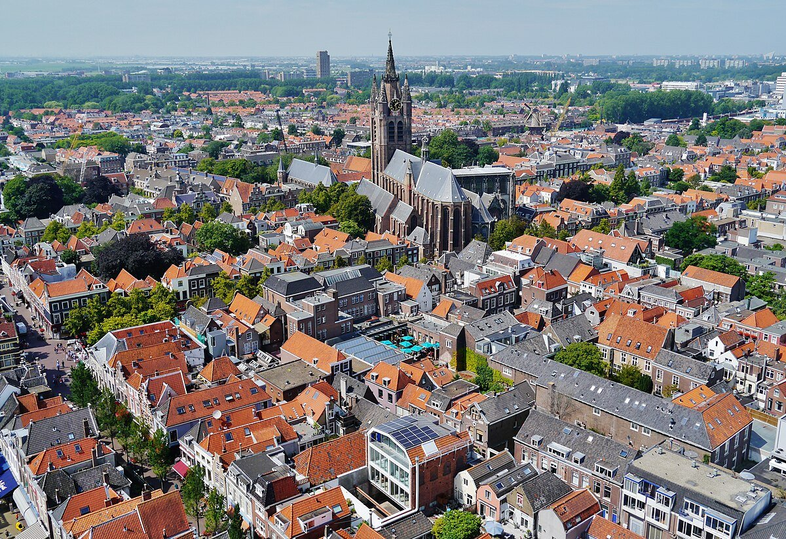<figcaption>Delft served as the base for Dutch site visits</figcaption></figure>

<!--
The cohort included 18 students: 14 women and 4 men, spanning sophomore through senior standing and several engineering interests. All were capstone eligible. The advertised cost was $4,900–$5,300. The final cost was $4,500 per student after department support of $750 each. Other support came from the Weidman Center and Kennedy Center scholarships. The group used one Delft hotel for all 14 Dutch nights, compared with six or seven hotels in prior programs. Daily drives were within 2.5 hours. The stable base reduced hotel changes and provided a place for study and devotionals. Demographics and costs: program director’s corrected account. Photo: original program deck.
-->

---

# Water infrastructure visited

<figure>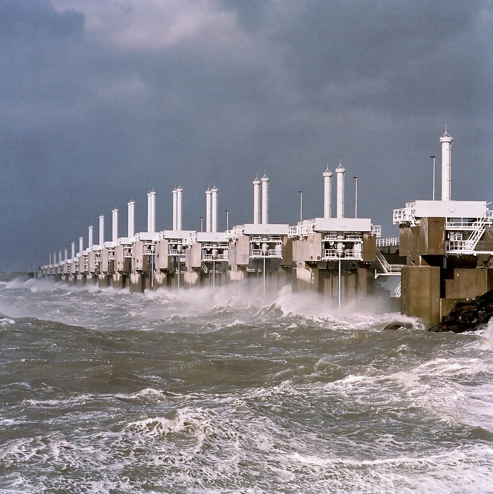<figcaption><strong>Oosterschelde</strong>Storm surge barrier and tidal ecology</figcaption></figure><figure>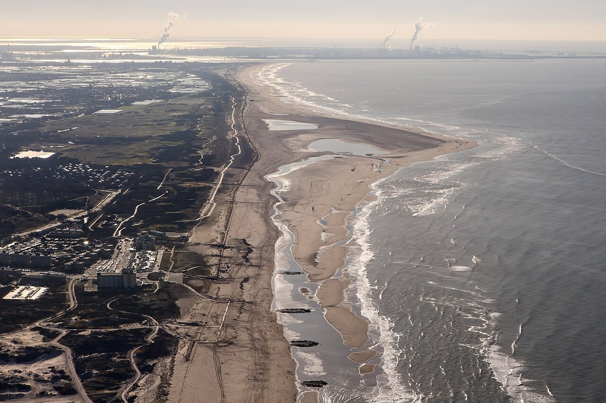<figcaption><strong>Sand Motor</strong>Coastal nourishment by wind and waves</figcaption></figure><figure>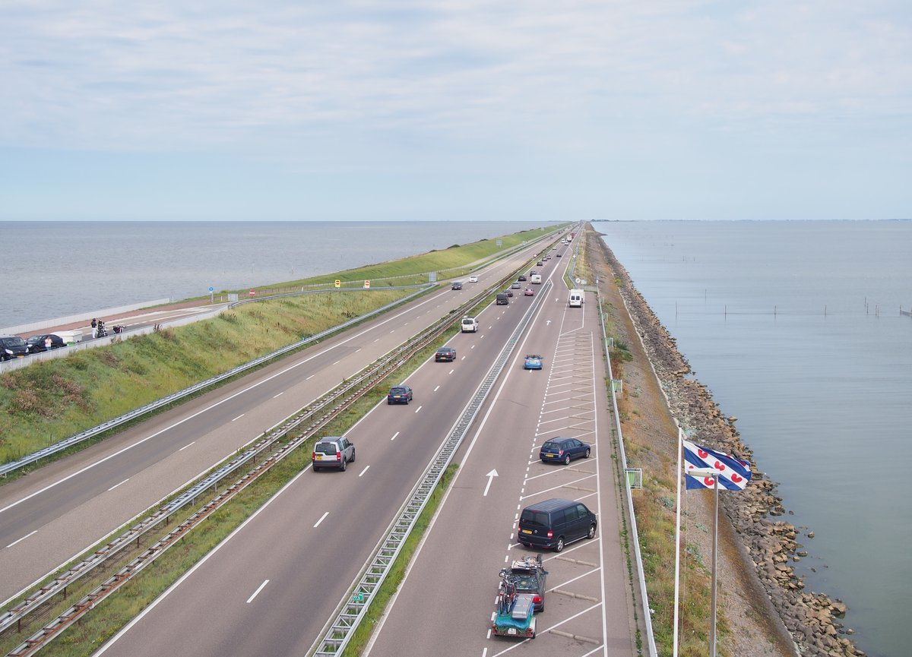<figcaption><strong>Afsluitdijk</strong>32 km enclosure dike and upgrades</figcaption></figure><figure>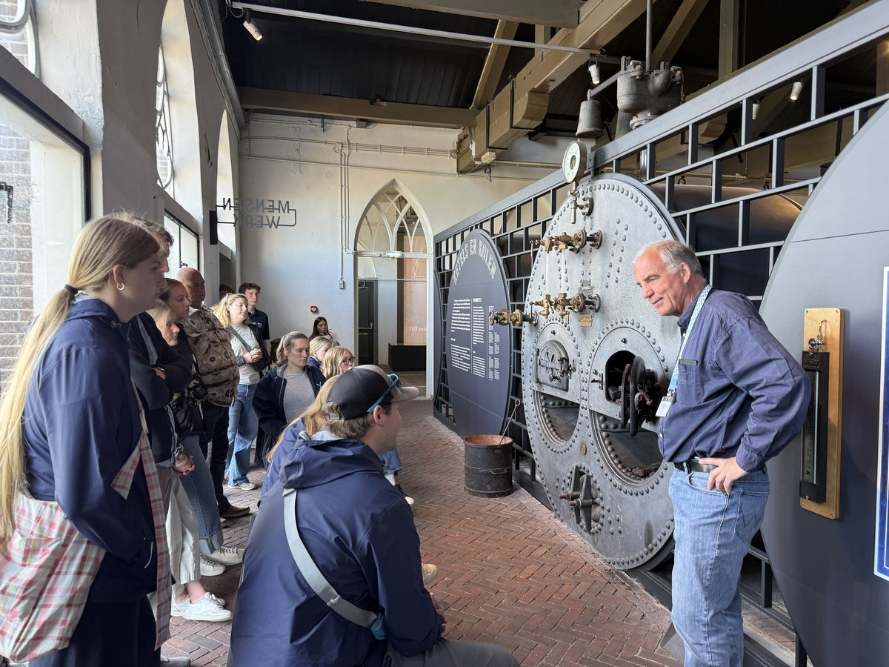<figcaption><strong>Cruquius</strong>Steam pumping and land reclamation</figcaption></figure><figure>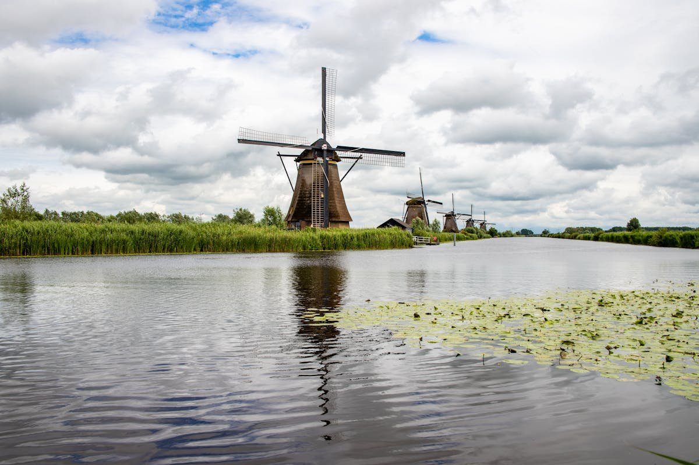<figcaption><strong>Kinderdijk</strong>Wind-powered polder drainage</figcaption></figure><figure>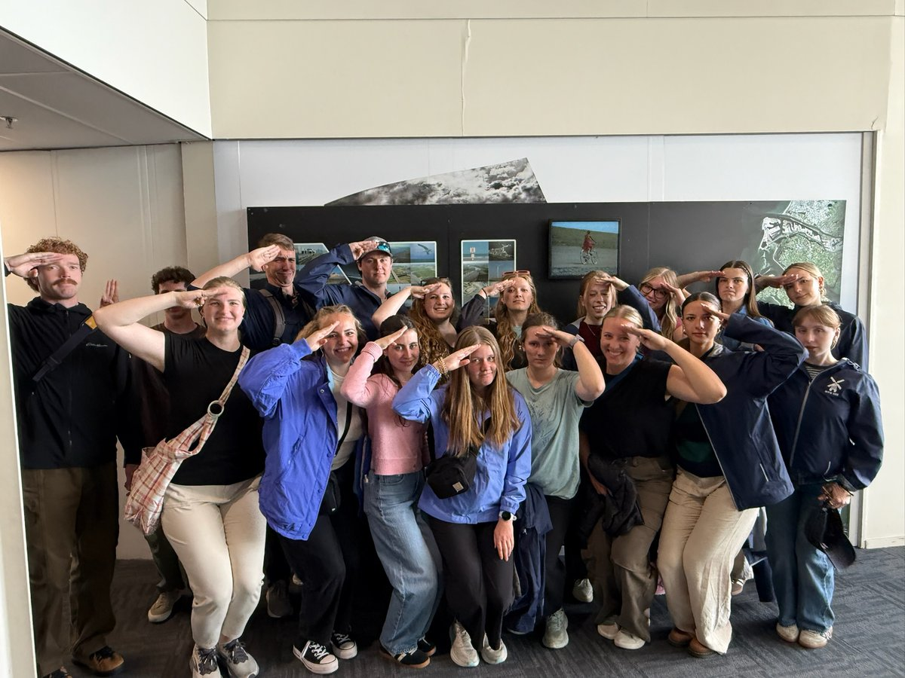<figcaption><strong>Neeltje Jans</strong>Delta Works visit and tidal-channel tour</figcaption></figure>

<!--
The visits covered both built defenses and approaches that use natural processes. At Oosterschelde, the 9 km barrier has 62 gates that preserve tidal exchange while protecting against storm surges. The group also took an inspection vessel into the tidal channels. The Sand Motor used 21.5 million cubic meters of sand, designed to nourish about 20 km of coastline over 20 years. The 32 km Afsluitdijk has enclosed the former Zuiderzee since 1932, with newer wave-dissipating armor. Kinderdijk and Cruquius illustrate the progression from wind to steam drainage, including reclamation of Haarlemmermeer. These methods coexist with current flood and coastal management. Site details and photos: original program deck. Kinderdijk photo: existing deck image library.
-->

---

# Five student capstone reports

<strong>1. Noordwaard</strong> Depoldering, flood storage, and damage estimates

<strong>2. Voorsterklei</strong> Dike relocation and floodplain expansion

<strong>3. Deventer</strong> Secondary channels and floodplain lowering

<strong>4. Overdiepse Polder</strong> Farm relocation onto raised mounds

<strong>5. Nijmegen / Waal</strong> Relief channel, flood exposure, and urban impacts

<strong>Deliverables:</strong> before/after GIS terrain analysis, bathtub flood models, and community impact audits.

<figure>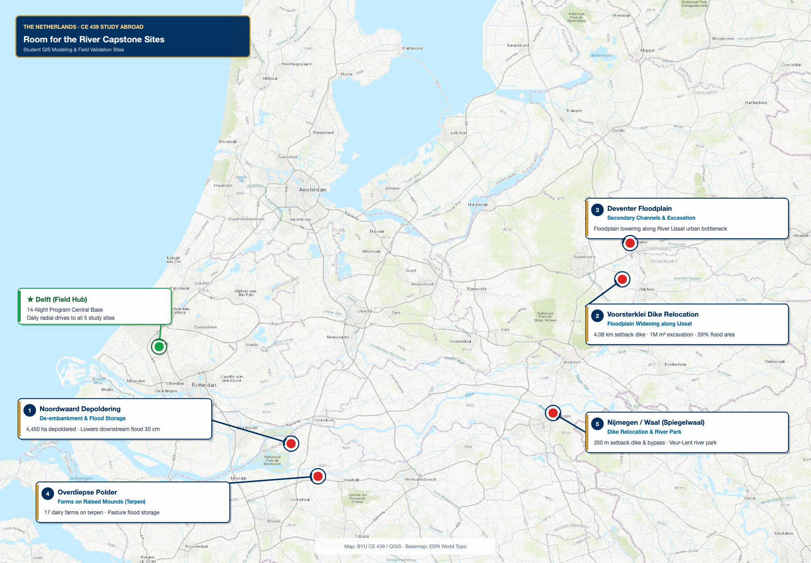<figcaption style="font-size:16px;margin-top:6px;color:#526779;">QGIS map showing the 5 capstone project sites and Delft field hub</figcaption></figure>

<!--
The final reports cover Noordwaard, Voorsterklei, Deventer, Overdiepse Polder, and Nijmegen/Waal. Teams reconstructed conditions before and after construction using terrain and infrastructure data. Their deliverables include flood maps, area and volume comparisons, exposure or damage estimates, and assessments of economic, social, and environmental impacts. The overview map built in QGIS shows the geographic distribution of all five project sites along the Waal, Bergsche Maas, and IJssel rivers, relative to our 14-night base in Delft. Sources: 2026 final reports, Teams 1–5, and student QGIS spatial models.
-->

---

# Report example: Voorsterklei

<figure>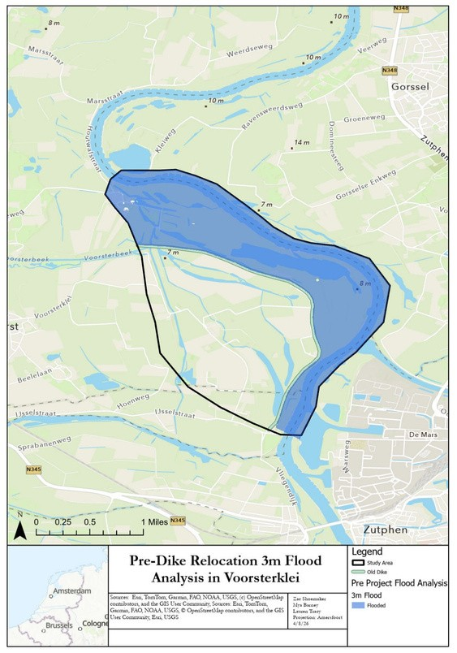<figcaption>Before relocation: <strong>302 ha</strong></figcaption></figure><figure>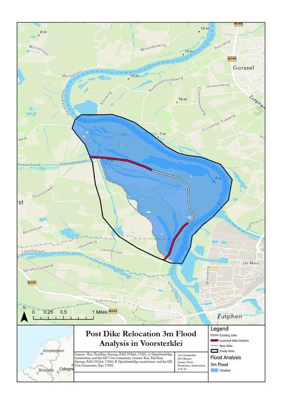<figcaption>After relocation: <strong>481 ha</strong></figcaption></figure>

<h2>59% more area inundated in the managed floodplain</h2>

Team 2's <strong>3 m scenario</strong> shows where water can spread after dike relocation.

More farmland accepts floodwater. The report also examines roads, building relocation, and farming impacts.

<strong>Model result:</strong> a static water-level scenario, not a measured flood.

Student maps and results: Team 2, Voorsterklei report, pp. 4, 13–15. Map credits retained in the figures.

<!--
Team 2 modeled flood scenarios using elevation data from before and after the Voorsterklei project. In its 3-meter scenario, inundated area increases from 302 to 481 hectares, approximately 59%. The report gives almost identical areas at its lower scenarios: 223 versus 225 hectares at 1 meter, and 292 hectares in both conditions at 2 meters. The comparison illustrates deliberate flooding of additional managed land. These are student GIS estimates under a flat water-surface assumption. They do not independently measure downstream flood reduction or simulate flow timing. Figures: Team 2, Voorsterklei Dike Relocation Audit Project Report, p. 13. Areas: pp. 4 and 15. The original map titles identify the pre- and post-project conditions. The report also considers infrastructure changes, agricultural exposure, and relocation costs.
-->

---

# Field observations and model limits

<figure>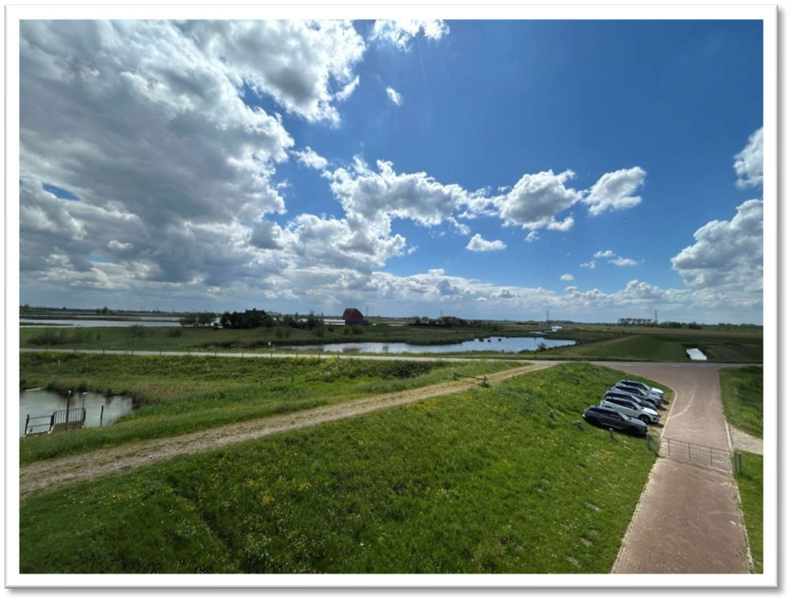<figcaption><strong>Noordwaard</strong> Flood storage alongside farms and access</figcaption></figure><figure>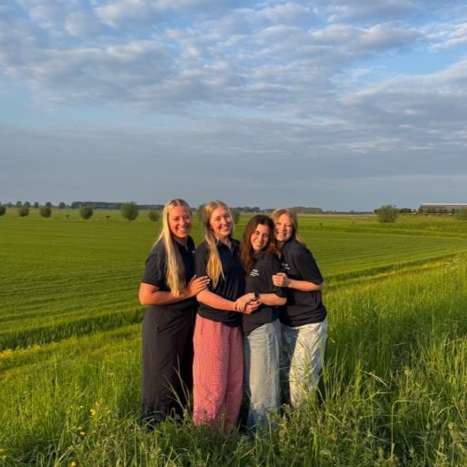<figcaption><strong>Overdiepse Polder</strong> Farm relocation and raised mounds</figcaption></figure><figure>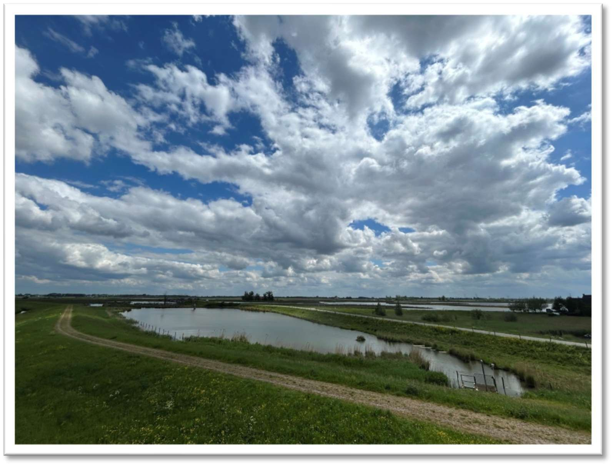<figcaption><strong>Noordwaard</strong> Habitat and recreation within the floodplain</figcaption></figure>

<strong>Site visits added context to the GIS work.</strong>

Static flood maps describe terrain and water levels. Field visits show how people use the land and where model assumptions need scrutiny.

Photos: Team 1 report, p. 26, and Team 4 report, p. 22. Model limitations: Team 1, p. 20.

<!--
The reports document field visits as well as desktop analysis. Team 1 visited Noordwaard on May 7, including an observation tower and the nature reserve. Team 4 visited Overdiepse Polder on May 8 and examined raised farm sites, dikes, and remnants of a demolished building. These observations put land use, relocation, and environmental impacts alongside the GIS calculations. Team 1 explicitly notes terrain-data limitations and buildings whose possible levee protection was not represented in its model. The reports provide evidence of student analysis and reflection, rather than independent validation of hydraulic performance. Photo credits: Team 1, Depoldering Noordwaard Project Report, p. 26, Figures 25–26; Team 4, Overdiepse Polder Final Report, p. 22, Figure 11. Field descriptions: Team 1, p. 23; Team 4, pp. 22–23.
-->

---

# Cultural and spiritual activities

<strong>Student-led devotionals</strong> Evening gatherings at the hotel

<strong>Temple and Church history</strong> The Hague Temple and Broeksterwoude baptism site

<strong>Museums and daily travel</strong> Anne Frank House, Rijksmuseum, Van Gogh Museum, cycling, and urban rail

Activities supporting BYU's educational aims

<figure>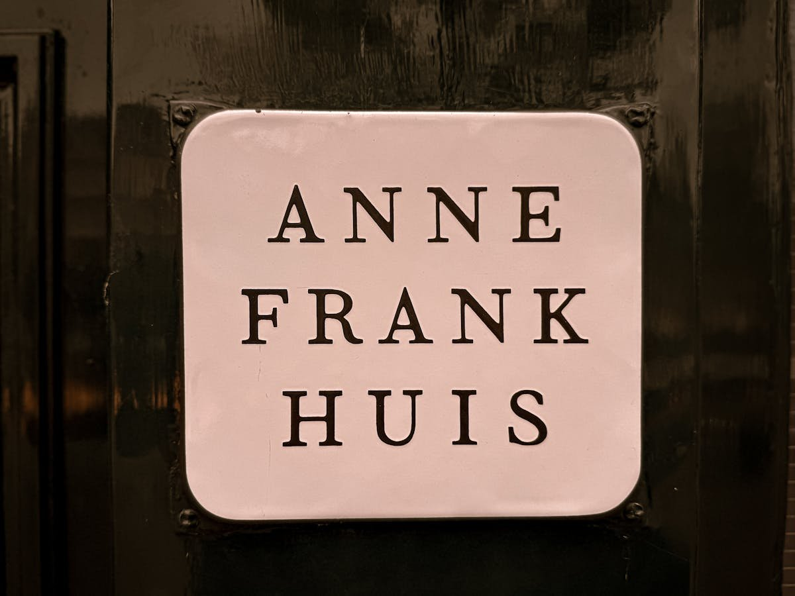<figcaption>Anne Frank House</figcaption></figure><figure>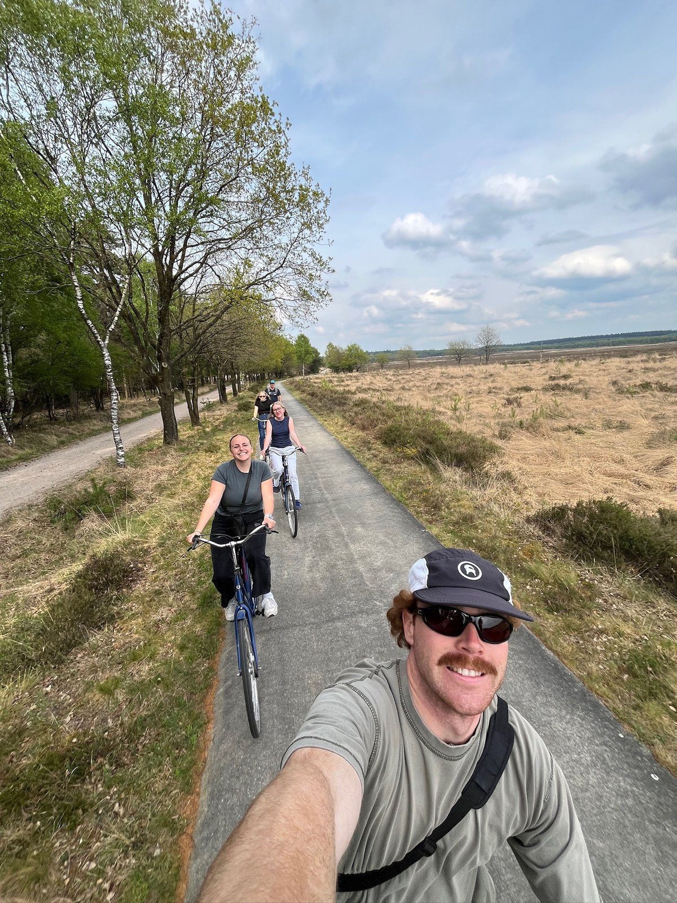<figcaption>Hoge Veluwe National Park</figcaption></figure>

<!--
The program included student-led devotionals at 9 p.m., proxy baptisms at The Hague Netherlands Temple in Zoetermeer, and a visit to Broeksterwoude, the site of the first Latter-day Saint baptisms in the Netherlands in 1861. Cultural activities included the Anne Frank House, Rijksmuseum, Van Gogh Museum, and cycling at Hoge Veluwe National Park. Students also used European rail and active transportation systems. These activities supported the spiritually strengthening, character-building, and intellectually enlarging aims of a BYU education. Activities and photos: original program deck.
-->

---

# Lessons learned: planning and logistics

<strong>Keep Delft as the 14-night base</strong> Saves time and logistics over moving hotels every few days Delft Best Western - better location than Royal Bridges Next time, include a group gathering room.

<strong>Mix rental cars and public transportation</strong> We did not need cars every day.

<strong>Track the budget during the trip</strong> About $4,000 went unspent that could have supported student meals or other benefits.

<strong>Simplify parking documentation</strong> Ask the Kennedy Center to waive receipts for parking under $50: we scanned 6–12 daily.

<figure>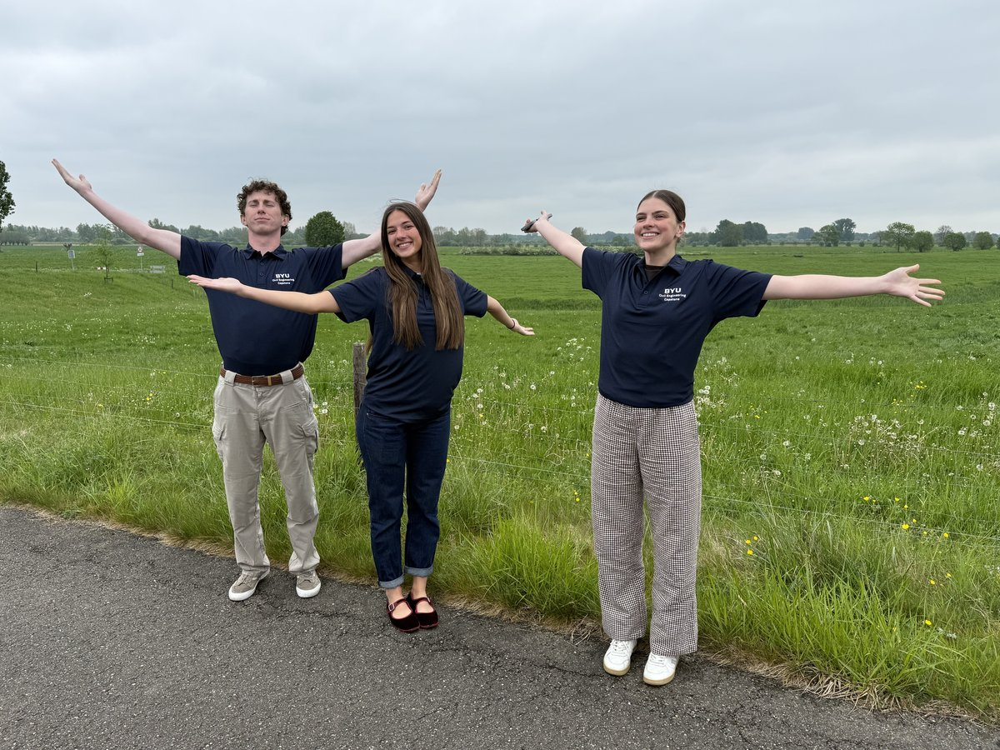<figcaption>A stable base made day trips practical</figcaption></figure>

<!--
Staying in Delft for 14 nights saved time and logistics over moving hotels every few days. Delft Best Western had a better location than Royal Bridges, but it lacked a group gathering space. A future hotel should meet both needs. Cars were useful for some visits, but public transportation could have covered other days. Renting cars only for the days they were needed could reduce costs and parking administration. About $4,000 remained unspent in the program budget. Closer tracking during the trip could have allowed more meals or other benefits for students. Scanning six to twelve parking receipts each day created a substantial administrative task. A proposed follow-up with the Kennedy Center is to request simpler documentation for parking charges below $50. This is a proposed change, not an existing exception. The program rotation remains Northern Europe in even years and the Dominican Republic in odd years, with opportunities for faculty advising, co-teaching, and research connections. Source: program director's account. Photo: original program deck.
-->

---

# Lessons learned: local systems

<h2>Access to medical care</h2>

A student’s allergic reaction required care. We called a nurse line for approval before the clinic visit.

<h2 style="margin-top:28px;">Collision paperwork</h2>

After a fender bender, both drivers completed and signed a form for the insurers and rental company.

No police attended our incident.

<figure>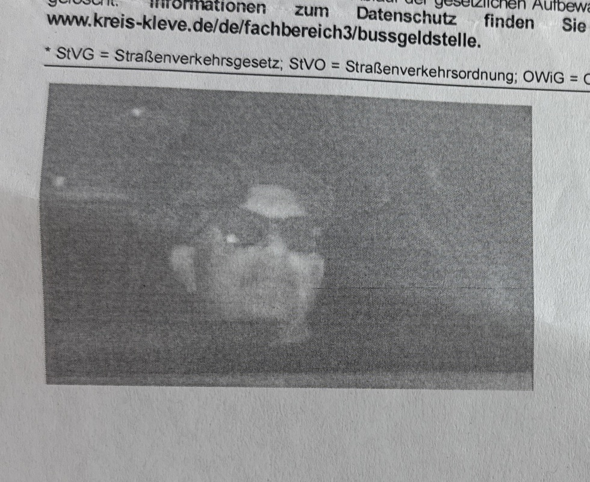<figcaption style="font-size:23px;color:#002e5d;"><strong>One souvenir arrived by mail.</strong> The German speeding ticket</figcaption></figure>

<!--
A student's allergic reaction required medical care. For this visit, the group first spoke with a nurse by telephone and obtained permission to attend the clinic. Learning the local route to care was part of the experience. A minor vehicle collision also required learning local procedures: both parties completed and signed a shared accident form for the insurance companies and rental company. Police were not involved in that incident. These descriptions concern the program's experiences, rather than general rules for medical emergencies or road collisions. The German speeding notice arrived after the trip. Its photograph provides a light closing example of an unexpected lesson about driving abroad. Source: program director's account and supplied photograph.
-->
