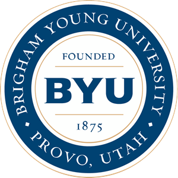
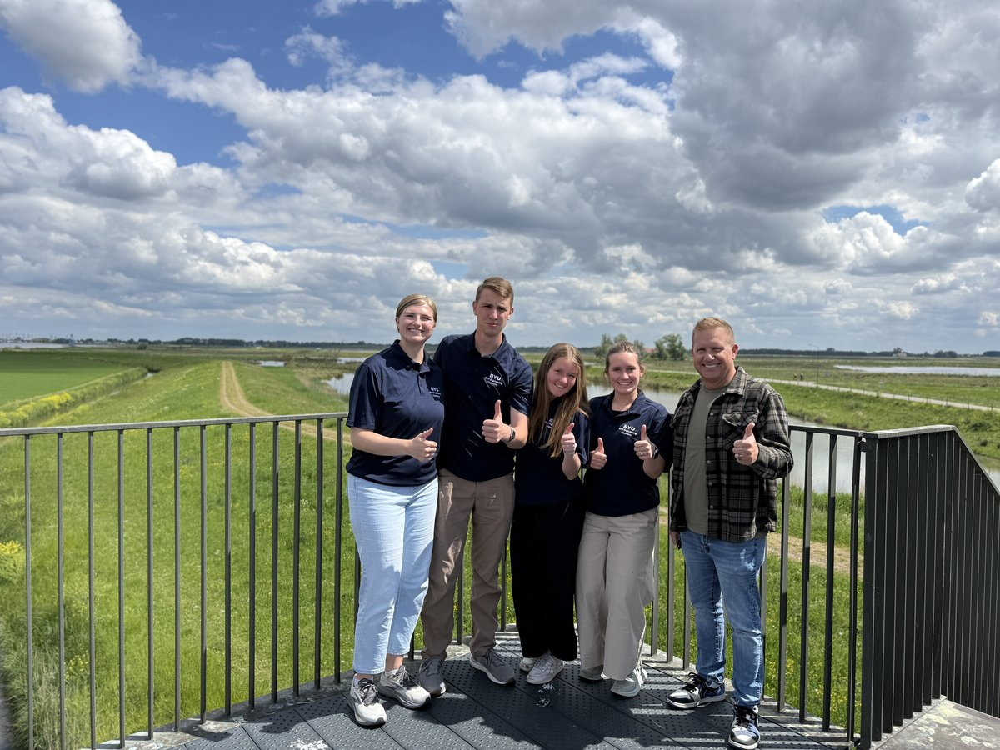

<!-- _class: lead -->
<!-- _paginate: skip -->

  

    

      
      Civil & Construction Engineering
    

    <h1>Water & Sustainability</h1>
    <h2>The Netherlands & Denmark Study Abroad</h2>
    

    
CE 439 / CE 498R Capstone Program

    
Dr. Daniel P. Ames · Program Director

    
Faculty Meeting Presentation · 5-Minute Overview

  

  

    
    

      <strong>2026 Student Cohort & Ames Family</strong> 
      Keukenhof Gardens, The Netherlands
    

  

<!--
SPEAKER NOTES (Slide 1 · 0:00 - 0:40)
- Good afternoon everyone. I'm excited to share a 5-minute report on our CE 439 Water & Sustainability Study Abroad program in The Netherlands and Denmark.
- As many of you know, our department runs biennial study abroad experiences. This year we took an exceptional group of civil engineering students to northern Europe to study the world's most sophisticated flood defenses and water management systems.
- This was an intensive, high-rigor capstone experience that combined winter-semester engineering prep with hands-on post-project audits in the field.
-->

---

<!-- header: "Program Overview · CE 439 / CE 498R" -->
<!-- footer: "BYU Civil & Construction Engineering · Water Resources Study Abroad" -->

# Global Context & Academic Structure

  

    

      <h2 style="font-size: 1.0em; margin-bottom: 6px;">🌍 Why The Netherlands & Denmark?</h2>
      

        <strong>26% of the Netherlands lies below sea level</strong>, and over 50% is flood-vulnerable. Century after century, Dutch civil engineers have pushed the state of the art—moving from historical land reclamation to the modern philosophy of <em>"Building with Nature"</em> and climate resilience.
      

    

    

      <h2 style="font-size: 1.0em; margin-bottom: 6px;">🎓 Rigorous Two-Stage Curriculum</h2>
      <ul style="font-size: 0.74em; margin: 0 0 0 16px; padding: 0; color: #334155; line-height: 1.55;">
        <li><strong>Phase 1 (Winter Prep):</strong> Students complete CE 414 (GIS) & CE 431 (Hydrology), plus weekly CE 471 prep covering Dutch hydraulic models and HEC-RAS flood modeling.</li>
        <li><strong>Phase 2 (Spring Field Study):</strong> 18 days in Europe (Copenhagen & Delft hub) performing site inspections and capstone project audits.</li>
      </ul>
    

  

  

    

      
      

        <strong>Copenhagen & Delft Field Hubs</strong> 
        Urban water resiliency, coastal barriers & harbor sustainability
      

    

    

      

        
18

        
Days in Field

      

      

        
3

        
Credit Hours

      

      

        
100%

        
Capstone Aligned

      

    

  

<!--
SPEAKER NOTES (Slide 2 · 0:40 - 1:25)
- Why the Netherlands? There is literally no better place on Earth to study water resources engineering. Over a quarter of the country is below sea level. They invented polders and dikes, and now they are leading the global transition to "Building with Nature."
- Academically, this is not a sightseeing tour. Students prepare throughout winter semester: they must take GIS and Hydrology, and in our prep sessions they build digital elevation models and run hydraulic flood inundation simulations.
- When they land in Europe, they already understand the hydraulic engineering behind each site they inspect.
-->

---

<!-- header: "Student Cohort · Diversity & Logistical Success" -->
<!-- footer: "BYU Civil & Construction Engineering · Water Resources Study Abroad" -->

# Student Cohort & Key Best Practices

  

    

      

        
19

        
Students in 2026

      

      

        
79%

        
Female Enrollment

      

    

    

      <h2 style="font-size: 0.95em; margin-bottom: 6px;">🌟 Exceptional Gender Diversity</h2>
      

        With <strong>15 female and 4 male engineering students</strong>, the program achieved historic female participation for our department, creating an incredibly supportive, dynamic team environment.
      

    

    

      <h2 style="font-size: 0.95em; margin-bottom: 6px;">🤝 Department & Weidman Center Support</h2>
      

        Generous funding from the <strong>Department of Civil & Construction Engineering</strong> and <strong>$1,400 scholarships per student</strong> from the Weidman Center for Global Leadership kept the program affordable and accessible.
      

    

  

  

    

      
      

        <strong>Delft, The Netherlands</strong> — Our 14-Night Central Field Hub
      

    

    

      <h2 style="font-size: 0.9em; margin-bottom: 4px; color: #002e5d;">🏨 Operational Best Practice: Single Hotel Hub</h2>
      

        In prior years, moving between 6–7 hotels caused logistics friction. In 2026, anchoring at <strong>one hotel in Delft</strong> for all 14 Dutch nights was our biggest operational win: day drives never exceeded 2.5 hours, students settled in, and group cohesion flourished.
      

    

  

<!--
SPEAKER NOTES (Slide 3 · 1:25 - 2:05)
- Look at these cohort numbers: 19 students, with 15 women and 4 men. Having 79% female representation in a Civil Engineering capstone cohort is something our entire department can celebrate.
- I want to publicly thank our department chair and the Weidman Center for Global Leadership. With departmental subsidies and the $1,400 Weidman scholarships, this life-changing experience was made affordable.
- Logistically, our best practice this year was staying in a single hotel in Delft rather than packing up every 2 nights. We did day trips in rental cars across the country, which saved huge administrative overhead and let the students focus on learning.
-->

---

<!-- header: "World-Class Engineering Field Laboratories" -->
<!-- footer: "BYU Civil & Construction Engineering · Water Resources Study Abroad" -->

# Monumental Hydraulic Infrastructure

  

    

      
      
<strong>Delta Works</strong>

    

    Storm Surge Barrier
    <h2 style="font-size: 0.85em; margin-bottom: 4px;">Oosterscheldekering</h2>
    

      9 km barrier with 62 steel gates protecting Zeeland province; one of modern engineering's 7 wonders.
    

  

  

    

      
      
<strong>The Sand Motor</strong>

    

    Building with Nature
    <h2 style="font-size: 0.85em; margin-bottom: 4px;">Zandmotor Mega-Dune</h2>
    

      21.5M m³ sand peninsula placed offshore, letting wind and currents replenish 20 km of coastline naturally.
    

  

  

    

      
      
<strong>The Afsluitdijk</strong>

    

    Enclosure Dike
    <h2 style="font-size: 0.85em; margin-bottom: 4px;">32 km Sea Barrier</h2>
    

      Separating the North Sea from IJsselmeer since 1932; currently reinforced with eco-concrete wave-dissipating blocks.
    

  

  

    

      
      
<strong>Cruquius & Windmills</strong>

    

    Historical Evolution
    <h2 style="font-size: 0.85em; margin-bottom: 4px;">Pumping Technology</h2>
    

      From 18th-century Kinderdijk drainage windmills to Cruquius (world's largest steam cylinder) draining Haarlemmermeer lake.
    

  

  <strong>Key Takeaway:</strong> Students witnessed the historical transition from mechanical brute-force pumping to passive, nature-based hydraulic engineering.
  Field Ground-Truthing

<!--
SPEAKER NOTES (Slide 4 · 2:05 - 2:55)
- Here are four of the incredible infrastructure sites our students inspected in person.
- The Oosterschelde Barrier in Zeeland—they walked inside the sluice gate chambers and took a boat out into the tidal channels.
- The Sand Motor: instead of dredging sand onto beaches every 3 years, the Dutch deposited 21 million cubic meters in one spot, and let natural wave energy distribute it over 20 years. That is "Building with Nature."
- The Afsluitdijk: a 20-mile causeway dam holding back the North Sea.
- And the history: seeing how they evolved from Kinderdijk windmills to the Cruquius steam pump which drained the lake where Schiphol Airport now sits.
-->

---

<!-- header: "Capstone Engineering Projects" -->
<!-- footer: "BYU Civil & Construction Engineering · Water Resources Study Abroad" -->

# Auditing "Room for the River" (*Ruimte voor de Rivier*)

  

    

      <h2 style="font-size: 0.95em; margin-bottom: 4px;">🌊 National Paradigm Shift Under Evaluation</h2>
      

        After major floods in 1993 & 1995, the Dutch government rejected merely raising dikes. Instead, the <strong>€2.3 billion "Room for the River"</strong> program gave rivers room to expand during extreme events.
      

    

    

      <h2 style="font-size: 0.92em; margin-bottom: 8px; color: #002e5d;">📋 5 Student Capstone Teams Conducted Audits:</h2>
      

        
<strong>Team 1 · Noordwaard:</strong> Depoldered 4,450 ha; dropped downstream flood peaks by 30 cm.

        
<strong>Team 2 · SBA (Kampen):</strong> IJssel delta bypass channel (*Reevediep*).

        
<strong>Team 3 · Nijmegen / Waal:</strong> Relocated dike 350m inland, creating river bypass & Veur-Lent island.

        
<strong>Team 4 · Overdiepse Polder:</strong> Moved farms to raised <em>terpen</em> (mounds) so agricultural land acts as flood storage.

        
<strong>Team 5 · Cortenoever:</strong> Lowered floodplains along the IJssel river.

      

    

  

  

    

      

        
        
<strong>Cortenoever Site Inspection</strong> BYU Capstone students in field

      

      

        
        
<strong>Depoldering Noordwaard</strong> Team 1 audit inspection

      

    

    

      <h2 style="font-size: 0.88em; margin-bottom: 4px;">📊 Capstone Project Deliverables</h2>
      

        Each team produced full professional reports evaluating: <strong>1)</strong> Hydraulic modeling accuracy (pre- vs post-project DEMs & flood maps), <strong>2)</strong> Economic and environmental ROI, and <strong>3)</strong> On-site ground verification.
      

    

  

<!--
SPEAKER NOTES (Slide 5 · 2:55 - 3:45)
- For their capstone deliverable, our students audited the Dutch "Room for the River" program.
- In the 1990s, the Dutch realized that building dikes higher and higher was unsustainable. They shifted to giving rivers room to flood safely: depoldering farmland, setting dikes back, and excavating side channels.
- We divided our students into 5 teams, each assigned to a different major project site: Noordwaard, Overdiepse Polder, Nijmegen on the Waal, and Cortenoever.
- In the classroom, they modeled these sites using DEMs and GIS; in Europe, they walked the dikes, interviewed engineers, and audited whether the real-world engineering delivered on its promises.
-->

---

<!-- header: "Intercultural & Spiritual Foundations" -->
<!-- footer: "BYU Civil & Construction Engineering · Water Resources Study Abroad" -->

# Fulfilling the AIMS of a BYU Education

  

    

      
      
<strong>Unity & Leadership</strong> Neeltje Jans, Zeeland

    

    Spiritually Strengthening
    <h2 style="font-size: 0.9em; margin-bottom: 6px;">Daily Group Devotionals</h2>
    

      Every evening at 9:00 PM, the group gathered at the hotel for student-led devotionals, connecting spiritual truths with civil engineering stewardship.
    

  

  

    

      
      
<strong>Heritage & Empathy</strong> Anne Frank House, Amsterdam

    

    Character Building
    <h2 style="font-size: 0.9em; margin-bottom: 6px;">Temple & Sacred History</h2>
    

      Students performed proxy baptisms at <strong>The Hague Netherlands Temple</strong> (Zoetermeer) and visited the historic 1861 LDS baptism site at Broeksterwoude in Friesland.
    

  

  

    

      
      
<strong>Cultural Immersion</strong> Hoge Veluwe White Bikes

    

    Intellectually Enlarging
    <h2 style="font-size: 0.9em; margin-bottom: 6px;">Intercultural Competence</h2>
    

      Visiting the Anne Frank House, Rijksmuseum, Van Gogh Museum, cycling across Hoge Veluwe National Park, and experiencing European urban transit.
    

  

<!--
SPEAKER NOTES (Slide 6 · 3:45 - 4:25)
- A BYU study abroad must fulfill the university's AIMS: spiritually strengthening, character building, and intellectually enlarging.
- Every night at 9 PM we held student-led devotionals. We visited The Hague Temple in Zoetermeer for proxy baptisms. We even visited Broeksterwoude in Friesland, the site of the very first LDS baptisms in the Netherlands in 1861.
- And culturally: standing inside the Anne Frank Secret Annex, exploring the Rijksmuseum, and riding the famous white bicycles through Hoge Veluwe. The students return home as more mature, empathetic global citizens.
-->

---

<!-- _class: lead -->
<!-- header: "" -->

  Looking Ahead
  <h1 style="color: #ffffff; font-size: 1.85em; margin-bottom: 12px;">Key Takeaways & Future Outlook</h1>
  

    An established, safe, and academically rigorous experiential learning model for BYU Civil & Construction Engineering.
  

  

    

      
✅

      <h3 style="color: #ffd780; font-size: 0.85em; margin: 0 0 6px 0;">100% On-Target</h3>
      

        On-schedule, on-budget, zero incidents, and 100% student capstone completion.
      

    

    

      
🔄

      <h3 style="color: #ffd780; font-size: 0.85em; margin: 0 0 6px 0;">Biennial Rotation</h3>
      

        Europe (2024, 2026, 2028) alternating with the Dominican Republic (2025, 2027).
      

    

    

      
🤝

      <h3 style="color: #ffd780; font-size: 0.85em; margin: 0 0 6px 0;">Faculty Invitation</h3>
      

        Encourage your undergrads to apply for 2027/2028, and let's explore co-teaching!
      

    

  

  

    
Thank you! Questions & Discussion

    

      Explore live web slides: <a href="https://danames.com/presentations/study-abroad/" style="color: #93c5fd; text-decoration: underline;">danames.com/presentations/study-abroad/</a>
    

  

<!--
SPEAKER NOTES (Slide 7 · 4:25 - 5:00)
- In conclusion: this program was on schedule, on budget, safe, and delivered real capstone engineering value for our students.
- Our department now has a proven biennial rotation: Northern Europe in even years, and the Dominican Republic in odd years.
- I encourage each of you to tell your students about this opportunity when they are planning their junior and senior years. If any faculty member is interested in partnering or participating in future trips, my door is always open.
- Thank you, and I'd be happy to take any questions!
-->
